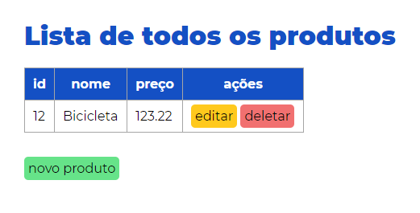
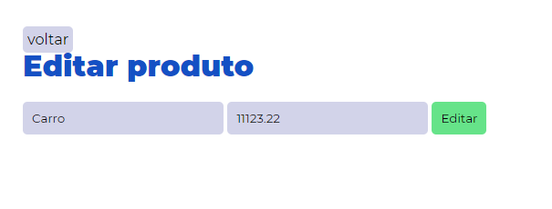
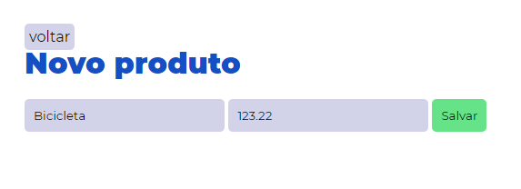

# CRUD com Spring MVC e Thymeleaf
 

> Meu primeiro projeto utilizando Spring MVC e Thymeleaf para construir páginas dinâmicas. 
> Todas as requisições serão interceptadas pelo **ProductController** que fará os tratamentos
> e redicionará para uma página html.

#### Tecnologias:
* Spring Boot
* Spring MVC
* Spring JPA
* MySQL
* Thymeleaf

 

### /produtos

### /editar/{id}

### /novo

